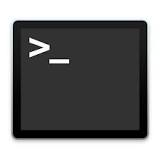
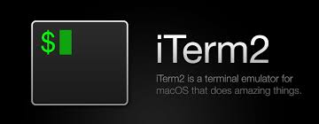
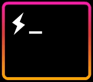

# Command Line

## What is Command line
When I first started to learn how to program, I remember that the Command Line Interface (CLI) was very intimidating. It was like black magic watching my developer friends hammer away commands into a black terminal. Just like everything in programming, the bare essentials of CLI is small. So what is CLI?

In the simplest form a CLI is a way for users to type in commands to interact with a computer.

However, there are some major confuse in the industry when it comes to terminology. Here are a few that get tossed around a lot to describe CLI.

- terminal: a place to input text
- console: is a physical hardware device
- shell: command line interpreter
- bash: a unix based shell

From my experience, some developers will just use these terminology to describe a CLI. Don't let this confuse you.

For our purposes we will be using the Mac OS X command line using the Bash shell, which is unix based shell. We will also use Apples default Terminal

Apple Terminal

For Windows users I'll cover this later but for now look in the additional resources to get started.

## Popular Shells and CLIs (Optional)

Once you get familiar with the basics, look into these other Shell and CLI options.

### Shells

I still just use bash but a lot of people use zsh

- 

- 

- 

### CLIs

my personal favorite is iterm2

- 

- 

## The Problem

Do you really need to learn CLI to program? The short answer is yes but I want to spend some time explaining this answer.

We modern computers having such great GUIs, one may wonder why we still need something like CLIs. Why can't developers just click around and open folders like everyone else in the world?

For most parts, you can get away with just using the GUI. The commands you will learn on this tutorial you can do all using the GUI. However, I urge you to learn to use the command line for a few reasons.

- Not all commands have a GUI especially 3rd party tools
- CLI is much faster than using the mouse
- Sometimes you will only have a CLI to work with
- It's super cool

## Basics commands for Mac OS X

Mac OS X is based on a Unix based operating system.
Just like every Soul Encoded tutorial. I highly encourage you to look through the bash documentation and find out more about these commands.

  - `cd`: change directory
  - `cd ~`: change directory to root
  - `cd ..`: go up one directory
  - `pwd`: print current directory path
  - `ls` : lists files in current directory
  - `mkdir`: create a new folder
  - `rmdir`: removes a folder
  - `touch`: create a new file
  - `mv`: move a file to a new location
  - `rm`: remove file
  - `cp`: copies a file
  - `man`: opens the manual of a command
  - `vim`: opens a vim editor
  - <kbd>Ctrl</kbd>+<kbd>C</kbd>: quit out of current process

If you forget what a command does, use the `man` command. e.g. `man cd` will bring up the manual for the cd command

## Vim and how to close it

If you tried the `man cd` command, you may wonder how to close out and return to your command line. The normal <kbd>Ctrl</kbd>+<kbd>C</kbd> will not work. This is because you are in vim. vim stands for Visual Editor iMproved. It's a Text Editor. I will cover vim on another tutorial, but for now just hit <kbd>ESC</kbd> then type in <kbd>:</kbd><kbd>q</kbd> and hit enter

## The Challenge

TIP: get used to using the spotlight tool built in Apple. Try <kbd>Command</kbd>+<kbd>Space</kbd> and type in `termianl` then hit enter.

TIP 2: try hitting `tab` after typing the first few letters of a file or directory. It will auto complete if it can. Use this feature.

1. navigate to the root of your terminal
2. make a new folder called `workspace`
3. change into the workspace directory
4. create a new directory named copy_me
5. change into copy_me directory
6. create a file called hello.js inside copy_me directory
7. list out the file and make sure the file was created
8. navigate back out one level up
9. copy the copy_me folder and create a delete_me folders
10. go into delete_me folder and delete the file inside
11. create another file inside delete_me directory
12. move that file into the copy_me directory
13. check your current path

remember to have fun with these challenges and play around with the command line.

## The Solutions

## Additional Resources

- [Apple Docs on Terminal](https://developer.apple.com/library/content/documentation/OpenSource/Conceptual/ShellScripting/CommandLInePrimer/CommandLine.html)
- [Let's Code Video on Terminal](https://www.youtube.com/watch?v=IGmfU6QU5dI)
